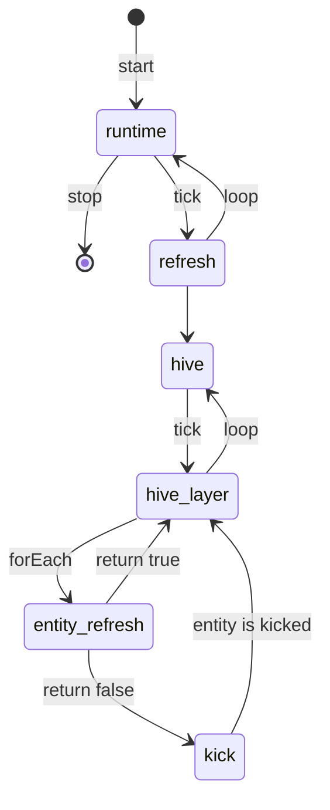
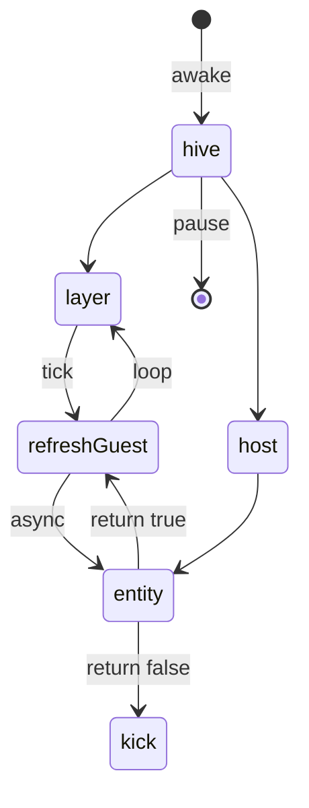
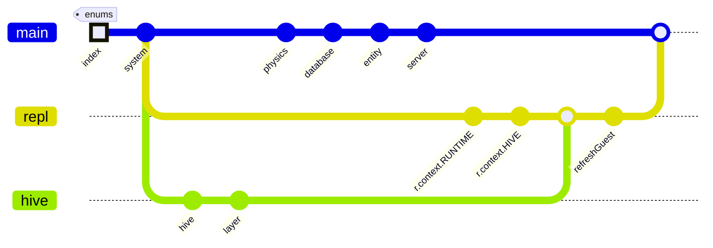
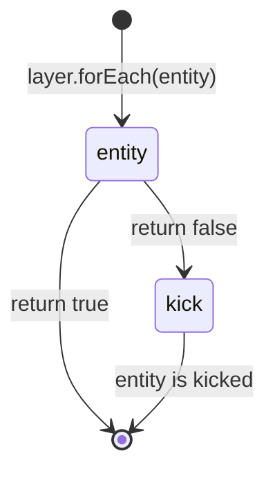
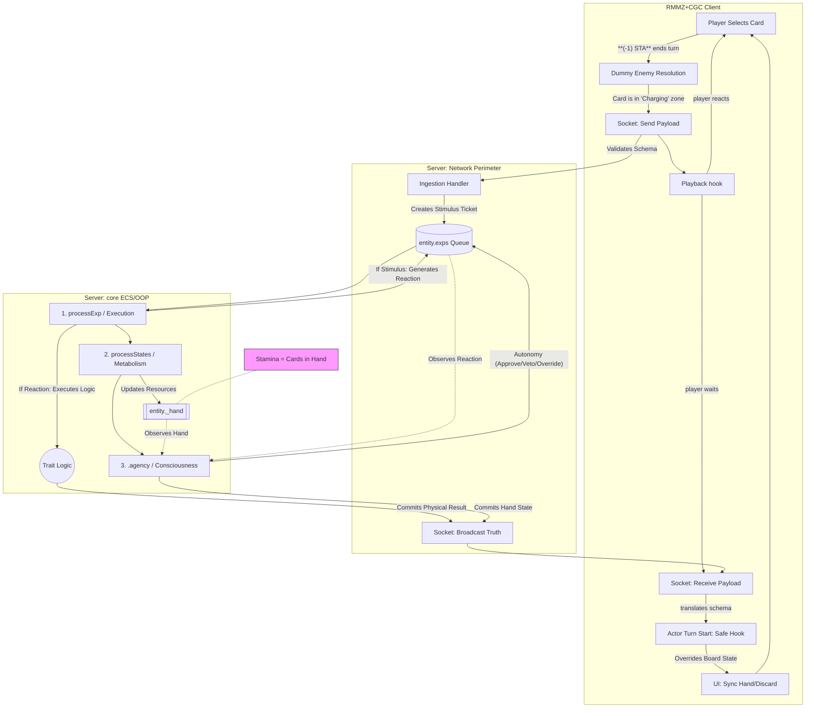

# Design Brainstorm

[*overview*]

[TOC]

## Runtime loop

[Back to top ⤴️](#design-brainstorm)

---

## Hive loop

### Dependency flow

[Back to top ⤴️](#design-brainstorm)

---

## Entity refresh loop

[Back to top ⤴️](#design-brainstorm)

---

## Integration loop

[Back to top ⤴️](#design-brainstorm)

---
